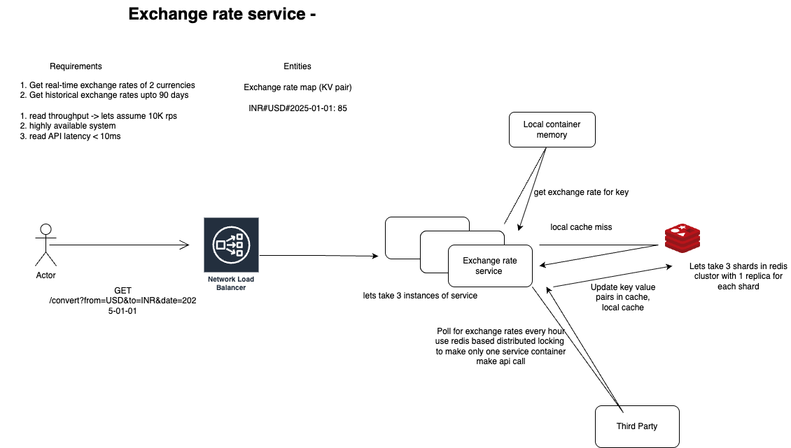

# 💱 Exchange Rate Service

A high-performance, currency exchange service built in **Golang** using **Clean Architecture**, **Gin**, and **DynamoDB**. It fetches real-time exchange rates from a third-party API and supports caching and historical lookups with cache refreshes every 30 mins.

---

## 🚀 Features

- ✅ Convert between fiat currencies (USD, EUR, INR, GBP, JPY) realtime or for historic dates upto 90 days
- ✅ Background job fetches & updates latest rates every 30 mins to have at max 1 hour of data staleness in multi application container    environment.
- ✅ DynamoDB + in-memory cache for low-latency responses
- ✅ RESTful API with Gin
- ✅ Clean Architecture for maintainability & testability
- ✅ Dockerized multi-container setup with Dynamo

---

## 🛠 High-Level Design



---

## 🧠 Architecture & Design Decisions

This document outlines the key architectural choices behind the Exchange Rate Service.

### 🧱 Key Components

| Component            | Tech/Tool         | Purpose                                                                 |
|----------------------|-------------------|-------------------------------------------------------------------------|
| HTTP API             | Gin (Go)          | Fast and lightweight REST API                                          |
| Caching              | sync.Map          | In-memory, per-container low-latency cache for read heavy workloads    |
| Persistent Store     | DynamoDB          | Stores all exchange rates for up to 90 days                            |
| Background Jobs      | Go routines       | Hourly & daily tasks for fetching & cleaning data                      |

---


### 🧠 DynamoDB

- **Why Dynamo**: We would be making very few api calls to DB since we are caching in application memory, so serverless DDB fits best in terms of cost, convinience and performance than running any DB instance.
- **Primary Key**: `fromCurrency#toCurrency` (e.g. `USD#INR`)
- **Sort Key**: `date` (e.g. `#2024-06-01`)
- **Attributes**:
  - `rate`: float64 — exchange rate
  - `ttl`: number — UNIX timestamp (date + 90 days)
  - `updated_at`: number — time the rate was last refreshed

#### ⏳ TTL
DynamoDB TTL is used to automatically purge data older than 90 days.

---

### 🔁 Background Jobs

#### ⏱️ Hourly Refresh Job
- Runs every **30 minutes** to make sure atmost 1 hour data staleness is there in multi service-container environment
- Uses a **distributed lock in DynamoDB** to ensure only one container makes third party call for current day and updates dynamo and in memory cache (write-through strategy)
- If service instance fails to acquire lock, it gets latest data from dynamo and updates in memory cache


#### 🧹 Daily In-Memory Cleanup Job
- Runs daily on each container
- Iterates through local `sync.Map`
- Deletes cached rates older than 90 days to save memory

---

### 🔐 Distributed Locking with DynamoDB

 - A special item in DynamoDB ensures only one job runs per cycle:
 - Use conditional PutItem api to update this item only when either item doesn't exist or now > expires_at.

```json
{
  "lock_name": "hourly_refresh",
  "expires_at": 1728012345
}
```

### 🔐 Assumptions

 - Request on differnet service containers can give different results for a particular request due to distributed locking flow but data for current date would have atmost 1 hour staleness.
 - Before starting service we make sure that data for last 90 days is prepoulated in DB (maybe via some script)

---

## 🧱 Project Structure

```text
exchange-rate-service/
├── cmd/server/ # App entrypoint
├── internal/
│ ├── controller/ # HTTP handlers
│ ├── domain/ # Models & interfaces
│ ├── router/ # Route wiring
│ ├── repository/ # data layer
│ ├── usecase/ # Business logic
├── pkg/ # Shared utils (clients, constants)
├── Dockerfile # Go app container
├── docker-compose.yml # App + DynamoDb setup
├── go.mod / go.sum # Dependencies
└── README.md
├── assets/
│   └── hld.png
├── infra/  #third party api calls
├── mocks/  #data mocks
├── jobs/  # contains cron jobs for refreshing and cleaning cache
```
---

## 📦 Setup Instructions

### 🔧 Prerequisites

- Go 1.21+
- Docker(client and daemon) & Docker Compose

---

### 🛠️ Run Locally (with Docker)

```bash
# Clone the repo
git clone git@github.com:ItsDee25/exchange-rate-service.git
cd exchange-rate-service

# Build and start
docker-compose up --build
```
--- 

## 🧪 API Testing

### `GET /currency/convert`

Converts an amount from one fiat currency to another for a given date (defaults to today).

**Query Parameters:**

| Param   | Required | Example      | Description              |
|---------|----------|--------------|--------------------------|
| `from`  | ✅        | `USD`        | Source currency code     |
| `to`    | ✅        | `INR`        | Target currency code     |
| `amount`| ✅        | `100`        | Amount to convert        |
| `date`  | ❌        | `2024-06-01` | Optional; defaults today |

**Test with curl:**

```bash
curl "http://localhost:8080/currency/convert?from=USD&to=INR&amount=100"
```

response-
```json
{
  "from": "USD",
  "to": "INR",
  "date": "2024-06-01",
  "amount": 100,
  "converted": 8312.0
}
```

### `GET /currency/getExchangeRate`

Returns the exchange rate between two fiat currencies for a given date (defaults to today).

**Query Parameters:**

| Param   | Required | Example      | Description              |
|---------|----------|--------------|--------------------------|
| `from`  | ✅        | `USD`        | Source currency code     |
| `to`    | ✅        | `INR`        | Target currency code     |
| `date`  | ❌        | `2024-06-01` | Optional; defaults today |

**Test with curl:**

```bash
curl "http://localhost:8080/currency/getExchangeRate?from=USD&to=INR"
```

response-
```json
{
  "from": "USD",
  "to": "INR",
  "date": "2024-06-01",
  "rate": 83.12
}
```
