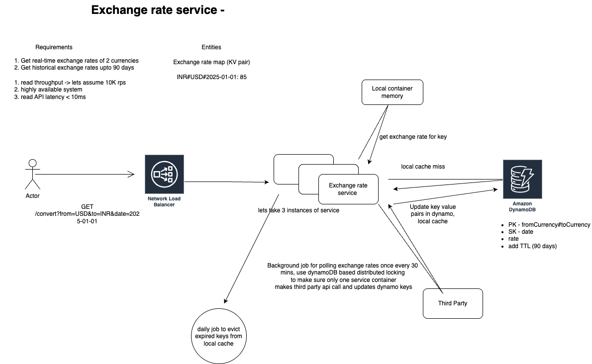

# 💱 Exchange Rate Service

A high-performance, currency exchange service built in **Golang** using **Clean Architecture**, **Gin**, and **Redis**. It fetches real-time exchange rates from a third-party API and supports historical lookups with hourly cache refreshes.

---

## 🚀 Features

- ✅ Convert between fiat currencies (USD, EUR, INR, GBP, JPY) realtime or for historic dates upto 90 days
- ✅ Hourly background job fetches & updates latest rates
- ✅ Redis + in-memory layered cache for low-latency responses
- ✅ RESTful API with Gin
- ✅ Clean Architecture for maintainability & testability
- ✅ Dockerized multi-container setup with Redis

---

## 🛠 High-Level Design



---

## 🧱 Project Structure

```text
exchange-rate-service/
├── cmd/server/ # App entrypoint
├── internal/
│ ├── controller/ # HTTP handlers
│ ├── domain/ # Models & interfaces
│ ├── router/ # Route wiring
│ ├── repository/ # Redis & API clients
│ ├── usecase/ # Business logic
├── pkg/ # Shared utils (logger, config)
├── Dockerfile # Go app container
├── docker-compose.yml # App + Redis setup
├── go.mod / go.sum # Dependencies
└── README.md
├── assets/
│   └── hld.png
```
---

## 📦 Setup Instructions

### 🔧 Prerequisites

- Go 1.21+
- Docker(client and daemon) & Docker Compose

---

### 🛠️ Run Locally (with Docker)

```bash
# Clone the repo
git clone git@github.com:ItsDee25/exchange-rate-service.git
cd exchange-rate-service

# Build and start
docker-compose up --build
```
--- 

## 🧪 API Testing

### `GET /currency/convert`

Converts an amount from one fiat currency to another for a given date (defaults to today).

**Query Parameters:**

| Param   | Required | Example      | Description              |
|---------|----------|--------------|--------------------------|
| `from`  | ✅        | `USD`        | Source currency code     |
| `to`    | ✅        | `INR`        | Target currency code     |
| `amount`| ✅        | `100`        | Amount to convert        |
| `date`  | ❌        | `2024-06-01` | Optional; defaults today |

**Test with curl:**

```bash
curl "http://localhost:8080/currency/convert?from=USD&to=INR&amount=100"
```

response-
```json
{
  "from": "USD",
  "to": "INR",
  "date": "2024-06-01",
  "amount": 100,
  "converted": 8312.0
}
```

### `GET /currency/getExchangeRate`

Returns the exchange rate between two fiat currencies for a given date (defaults to today).

**Query Parameters:**

| Param   | Required | Example      | Description              |
|---------|----------|--------------|--------------------------|
| `from`  | ✅        | `USD`        | Source currency code     |
| `to`    | ✅        | `INR`        | Target currency code     |
| `date`  | ❌        | `2024-06-01` | Optional; defaults today |

**Test with curl:**

```bash
curl "http://localhost:8080/currency/getExchangeRate?from=USD&to=INR"
```

response-
```json
{
  "from": "USD",
  "to": "INR",
  "date": "2024-06-01",
  "rate": 83.12
}
```
